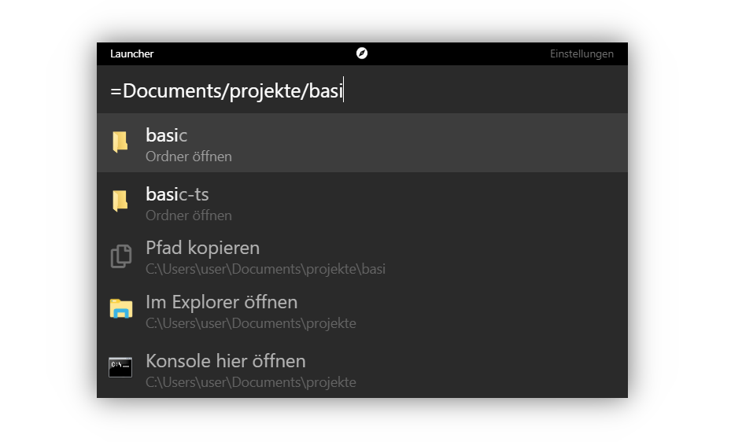
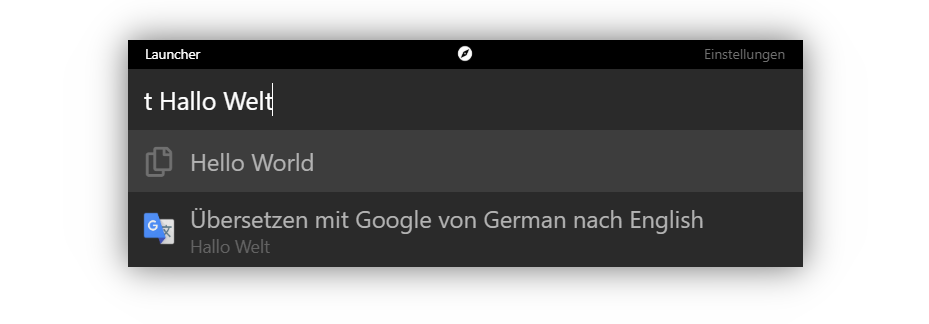

# Launcher
Ein Open-Source-Launcher, der vollständig erweiterbar ist. Schnellzugriff auf Einstellungen, Webseiten oder Programme. Einfach installieren, starten und bei Bedarf erweitern.
Es gibt verschiedene Module, die viele verschiedene Funktionen mitbringen.

## Getting Started
### Download
Auf der [Release Page](https://github.com/otsmr/launcher/releases) gibt es die aktuelle Version des Launchers zum herunterladen.

### Kompilieren

```bash
git clone https://github.com/otsmr/launcher.git
cd launcher
npm install
npm run dist
```

# Alle Module

* Module anzeigen/verwalten: **?**


## Dateiensuche *(Windows)*
* Prefix: **>**


Mithilfe des SYSTEMINDEX von Windows und der Powershell in Sekundenschnelle Dateien und Ordner finden. Suche basiert auf [filesearch](https://github.com/otsmr/filesearch).


### Beispiele
**Suche alle Bilder** [Mehr](https://github.com/otsmr/filesearch#extstringarray)
- ```>* -ext png,jpg,bmp```
- ```>* -kind picture```  

**Alle .mp4 Filme über einem GB** [Mehr](https://github.com/otsmr/filesearch#sizestring)
- ```>*.mp4 -size >=1g```  
- ```>* -size >=1g -ext mp4```  

[Mehr Beispiele](https://github.com/otsmr/filesearch#extstringarray)


## Lesezeichen
Lesezeichen von Firefox und Google Chrome durchsuchen. 
* Prefix: **b**


## Taschenrechner


## Duden

Wörter auf [duden.de](https://duden.de) nachschlagen
* Prefix: **duden**


## Dateiexplorer  *(Windows)*

Schnellzugriff auf Dateien und Ordner
* Prefix: **=**




## OnTop

* Prefix: **top**

Webseiten in einem Popup Fenster öffnen, dass sich immer ganz oben befindet


## Programme *(Windows)*

Nach Programmen suchen


## Schnellstarter

Computer schnell Herunterfahren, Neu Starten, ... 


## Screenshot *(Windows)*

* Prefix: **shot**


## Übersetzer

Schnell mit **Google Translate** Texte übersetzen


## Speedtest


## Suchmaschinen

Schnellzugriff auf Suchmaschinen  
Engine hinzufügen unter *config*  


**Autocomplete**


## Wetter
Schnellzugriff auf die Wetterdaten von [wetter.com](https://wetter.com)


## YouTube
Zugriff auf YouTube Abos mit [oabos.de](https://oabos.de)


**Popup**  
Videos werden in einem Popup Fenster geöffnet, welches sich immer ganz oben befindet

